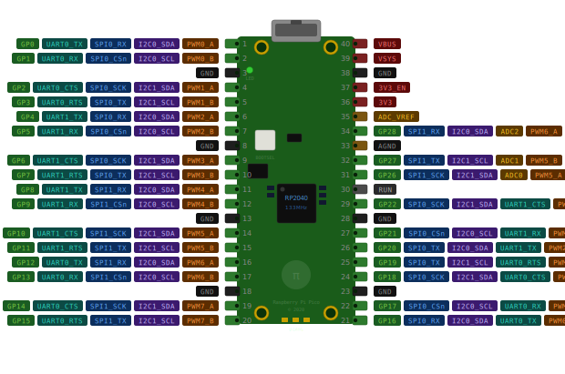

# RP2040 I2C

Este dispositivo configura a I2C da placa Raspberry Pi Pico RP2040.

## Exemplo

Clique na imahem abaixo para carregar o exemplo.

> Esta é uma imagem com esteganografia; ela oculta dados binários do projeto. Não a edite.
